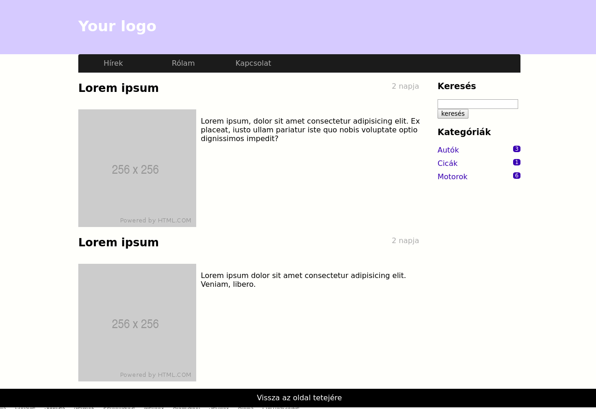
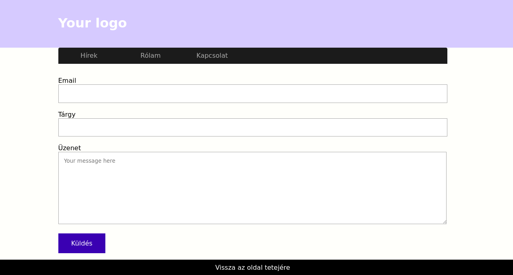

# HTML workshop

 - Hozd létre az alábbi 3 `.html` kiterjesztésű fájlt egy könyvtáron belül.
   - index.html
   - about.html
   - contact.html
- Hozz létre egy `css` nevű mappát, és másold bele a `style.css` fájlt.
- Építsd fel az oldal layout-ját.
  - Alap HTML felépítés (html, head, body)
  - A `css/style.css` fájlt állítsd be az oldal stíluslapjának
- Készítsd el a kezdőlapot az alábbi kép alapján az `index.html` fájlba.

- A CSS fájl tartalma alapján kitalálhatod a használt tag-eket és a használt class-eket.
  - tagneve
  - .classneve
  - #IDneve
  - A  B        // `A` tartalmazza `B`-t.

- Hasonlóan az `index.html` fájlhoz, készítsd el a `contact.html` fájlt is. A form-nak nem kell adatot küldenie még.

- Az `about.html` fájlba készíts egy önéletrajzot
  - Használj
    - felsorolást
    - címsorokat
    - félkövér és dölt betűket
    - HTML5 tag-eket
