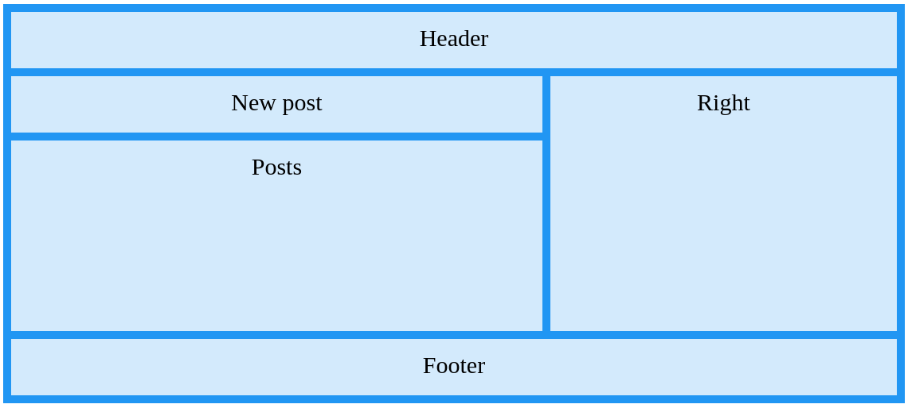

# CSS feladat

 - Hozd létre a képen látható felépítéssel rendelkező oldalt! A szín, margin, padding értékeket szabadon változtathatod!
   - W3Schools-on található egy nagyon hasonló felépítésü oldal a CSS grid layout leírásánál (https://www.w3schools.com/css/css_grid.asp).
     

- Az oldal egy egyszerű közösségi oldal, a megvalósítandó rész a kezdőlapon található hírfolyam.

- Az oldal elkészítéséhez szabad kezet kaptok, azonban az alábbi kritériumoknak meg kell felelnie:

   - Használj lekerekített sarkokat (border-radius)
   - Az odalon legyen input tag, amit CSS segítségével megformázol
   - Használj :hover pszeudo osztályt (például linkekhez)

