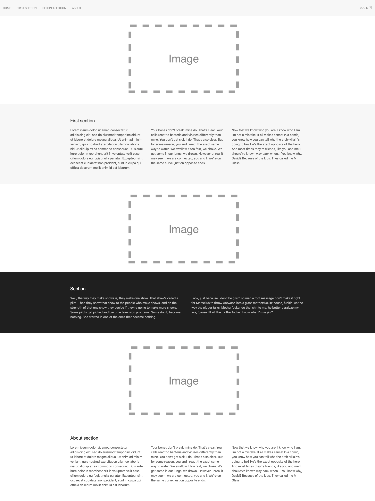
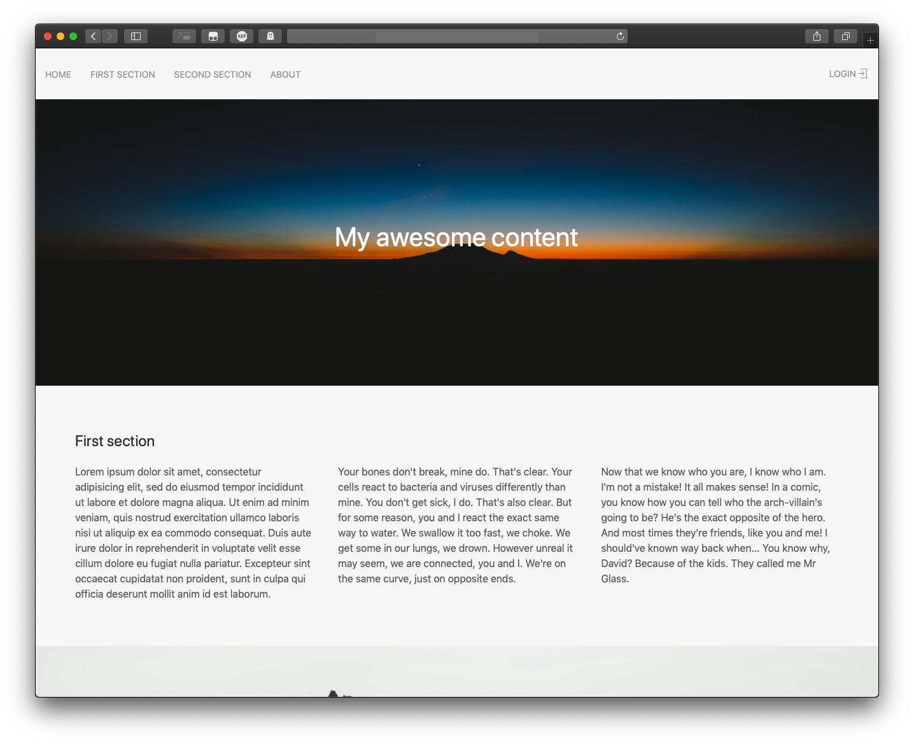
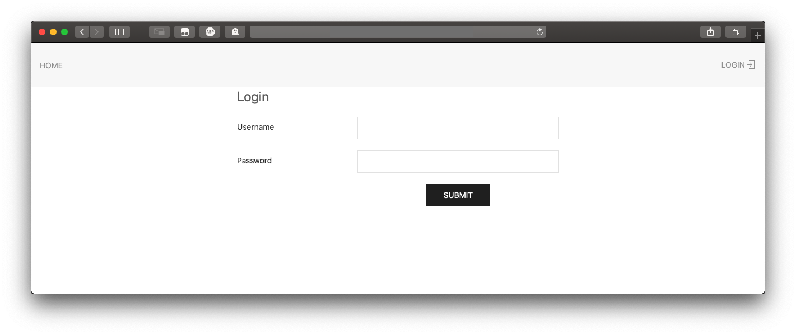

# Feladat

Ezen a gyakorlaton egy one pager oldal lesz a feladat. Ezt későbbiekben könnyen át lehet szabni például egy bemutatkozó oldalnak is.

## Előkészület

Hozzuk létre az `index.html`-t és importáljuk a [UIKit](https://getuikit.com/docs/introduction) keretrendszert valamelyik lentebbi módon:

Amennyiben letöltöttük az oldalról a forrást és ebbe a mappába kitömörítettük:

```html
<head>
	<meta name="viewport" content="width=device-width, initial-scale=1">
    <link rel="stylesheet" href="css/uikit.min.css" />
    <script src="js/uikit.min.js"></script>
    <script src="js/uikit-icons.min.js"></script>
</head>
```

Illetve CDN-t használva:

```html
<head>
	<meta name="viewport" content="width=device-width, initial-scale=1">
	<link rel="stylesheet" href="https://cdnjs.cloudflare.com/ajax/libs/uikit/3.0.0-rc.17/css/uikit.min.css" />
	<script src="https://cdnjs.cloudflare.com/ajax/libs/uikit/3.0.0-rc.17/js/uikit.min.js"></script>
	<script src="https://cdnjs.cloudflare.com/ajax/libs/uikit/3.0.0-rc.17/js/uikit-icons.min.js"></script>
</head>
```

## Feladatok

- Az oldal tetején legyen egy [navbar](https://getuikit.com/docs/navbar). Ez a görgetéssel is maradjon fixen az oldal tetején (sticky).
- Ezt egy rövid bemutatkozó szöveg kövesse, [melynek van háttere](https://getuikit.com/docs/background)
- Ezek után töltsük fel tartalommal az oldalt egymást váltakozó képekkel és szekciókkal.
  - [Szekciók](https://getuikit.com/docs/section)nál az oszlopok esetében legyen 1/2-ed, vagy 1/3-ad szélesség, de csak [medium vagy annál nagyobb kijelző szélességen](https://getuikit.com/docs/width).
  - Képek esetében legalább egyszer alkalmazzunk [parallax görgetést](https://getuikit.com/docs/parallax)
  - Képeket érdemes például [innen](https://unsplash.com/collections) válogatni
- Amennyiben készen van az oldal, minden szekciónak adjunk `id`-t és a navbar-ban hozzunk létre rájuk hivatkozásokat. Adjunk hozzá egy jobbra rendezett elemet, melynek szövege 'Login' és van egy `sign-in` [ikon](https://getuikit.com/docs/icon) mellette, mely a `login.html`-re mutat.
- Hozzuk létre a `login.html`-t és másoljuk át az előzőleg elkészített oldalról a `header`-t és a `navbar`-t, ahonnan töröljük ki a szekciókra mutató linkeket.
- Hozzunk létre egy [container](https://getuikit.com/docs/container)-t, mely [közepes méreten, vagy afelett 1/2-ed széles](https://getuikit.com/docs/width). Adjunk hozzá egy [horizontal form](https://getuikit.com/docs/form)-ot, egy `username`, egy `password` mezővel és egy `submit` gombbal.
- Nézzük meg a végeredményt különféle böngészőméretezéssel, vagy a fejlesztői eszközök között 'mobile view'/'responsive design'-al.

## Példa képernyőképek

Index:





Login:

